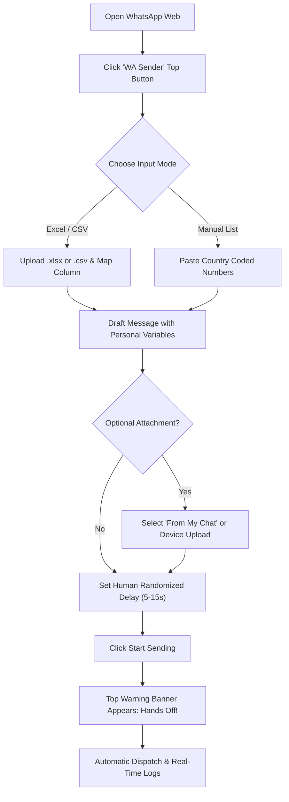

# 🚀 WA Direct Sender — Unlimited WhatsApp Web Automation

[](https://developer.chrome.com/docs/extensions/mv3/intro/)
[](https://web.whatsapp.com)
[](#-privacy--security)
[](LICENSE)

A powerful, private, and completely free Chrome extension for **WhatsApp Web automation**. Built with **Manifest V3**, **vanilla JavaScript**, and client-side Excel/CSV parsing. 

> **Zero arbitrary quotas. Zero message limits. No monthly subscriptions. 100% Private (No data leaves your computer).**  
>  
> *"Why pay if I could build it? That's the fun of being a developer!"*  
> 📢 *Planning to launch or share this project? See the complete [Promotion & Social Launch Plan](PROMOTION_PLAN.md).*

---

## 🌟 Key Features

### 📊 1. Excel (.xlsx, .xls) & CSV Contact Imports
- **Instant File Parsing:** Reads spreadsheets client-side via embedded `SheetJS` (no file uploads to external servers).
- **Smart Column Detection:** Automatically detects phone number headers (`Phone`, `Mobile`, `Contact`, `Tel`, etc.).
- **Live Sample Data Preview:** Under the column dropdown, instantly preview the first 4 phone numbers in formatted badges with non-numeric safety warnings.
- **Dynamic Variable Tags:** Insert custom columns into your message templates in 1 click (e.g. `Hi {Name}, your order #{Order_ID} for {Item} is confirmed!`).

### ✍️ 2. Manual Quick Dispatch
- Paste lists of phone numbers directly (comma, semicolon, or newline separated).
- Automatically sanitizes international phone numbers and strips formatting characters.

### 📎 3. Dual Attachment Modes (Zero "Forwarded" Tag)
- **Option 1: From My Chat (Recommended):** Forward media (photos, videos, documents) stored in your personal "Message Yourself" (You) chat. Built with anti-status protection so media is never accidentally sent to status stories.
- **Option 2: Direct Device Upload:** Directly attach photos, PDFs, or documents from your device into recipient conversations.
- **Sequence Flexibility:** Choose whether to send *Text First, then Attachment* (Default & Recommended) or *Attachment First, then Text*.
- **Mandatory Text Safeguard:** Enforces accompanying text messages to maintain conversational integrity.

### 🛡️ 4. Anti-Ban Humanized Dispatch Engine
- **Randomized Delays:** Set customizable minimum and maximum intervals (e.g. 5–15 seconds) between messages to emulate human pacing and evade spam heuristics.
- **Top Safety Notification Banner:** Displays a fixed alert banner across WhatsApp Web during active runs (`⚠️ DO NOT TOUCH WHATSAPP: Automation is active`).
- **One-Click Panel Minimize / Restore:** Minimize the drawer directly from the top banner to keep WhatsApp Web visible, or expand it anytime to inspect details.
- **Progressive Controls:** Dynamic `⏸ Pause`, `▶ Resume`, and `⏹ Stop` controls on both the banner and the drawer. Start buttons show live shimmer spinners: `⏳ Dispatching (X/Total)...`.
- **Fault-Tolerant Skipping:** Invalid numbers or network hiccups are gracefully caught, logged, and skipped without breaking the queue.

### 📜 5. Local Audit Logs & CSV Export
- Real-time in-drawer transaction table with color-coded badges (`Sent`, `Failed`, `Skipped`).
- Stores historical delivery records securely in `chrome.storage.local`.
- Export audit logs to downloadable CSV spreadsheets with one click.

---

## 📥 Installation Guide

### Method 1: Pre-Built Release ZIP (Recommended for Users)

1. Head over to the [**GitHub Releases**](https://github.com/nil-frontend/WA-Automation/releases) section.
2. Download the latest `custom-extension.zip`.
3. Unzip / Extract the ZIP file into a convenient folder on your computer.
4. Open Google Chrome and enter `chrome://extensions` in the address bar.
5. In the top-right corner, switch **Developer mode** to **ON**.
6. In the top-left corner, click **Load unpacked**.
7. Select the unzipped folder containing `manifest.json`.
8. Navigate to [web.whatsapp.com](https://web.whatsapp.com).
9. You'll see a green **`WA Sender`** pill button pinned in the top bar—click it to open your automation drawer!

---

### Method 2: Git Clone (For Developers)

```bash
# 1. Clone this repository
git clone https://github.com/nil-frontend/WA-Automation.git

# 2. Open Chrome extensions manager
# Visit chrome://extensions in Chrome, enable "Developer mode"

# 3. Click "Load unpacked" and select the cloned directory
```

---

## 💡 Quick Start Tutorial



1. **Upload Contacts:** Switch to the **Excel / CSV Upload** tab, drag and drop your `.xlsx` or `.csv` spreadsheet.
2. **Review Preview:** Ensure the phone column is selected; verify the sample 4 numbers in the preview badges.
3. **Write Template:** Type your message. Click any column chip (`{Name}`, `{City}`, etc.) to insert dynamic variables.
4. **Configure Media (Optional):** Toggle attachments on, pick Option 1 (My Chat) or Option 2 (Upload), and specify order.
5. **Set Safe Delay:** Keep default random delay (e.g. 5–12 seconds).
6. **Start Campaign:** Click **Start File Campaign**. Watch the live progress bar, pause/resume as needed, and export delivery logs upon completion.

---

## 🔒 Privacy & Security

- **100% Local Execution:** Everything runs locally inside your Chrome browser session.
- **Zero Third-Party APIs:** No external database connections, no analytics, no remote servers, no cookies collected.
- **Direct Session Handshake:** Interacts strictly with your authenticated WhatsApp Web tab.

---

## ⚠️ Anti-Ban Recommendations & Disclaimer

> [!IMPORTANT]
> **Use Responsibly:** WhatsApp enforces strict anti-spam guidelines. This software is intended for transactional notifications, customer updates, and communications to consenting contacts.

- **Warm-Up Your Account:** If your WhatsApp number is new, start with 20–30 messages per day and gradually increase.
- **Use Realistic Delays:** Never set delays below 5 seconds. A 7–15 second randomized interval closely mimics genuine human typing.
- **Personalize Messages:** Use `{Variables}` so each outgoing text is unique rather than identical bulk text.
- **Disclaimer:** *This project is an independent open-source tool and is not affiliated, associated, authorized, endorsed by, or in any way officially connected with WhatsApp LLC or Meta Platforms, Inc.*

---

## 🤝 Contributing

Contributions, feature suggestions, and bug reports are welcome!
1. Fork the Project
2. Create your Feature Branch (`git checkout -b feature/NewFeature`)
3. Commit your Changes (`git commit -m 'Add NewFeature'`)
4. Push to the Branch (`git push origin feature/NewFeature`)
5. Open a Pull Request

---

## 📄 License

Distributed under the **MIT License**. See `LICENSE` for more information.
